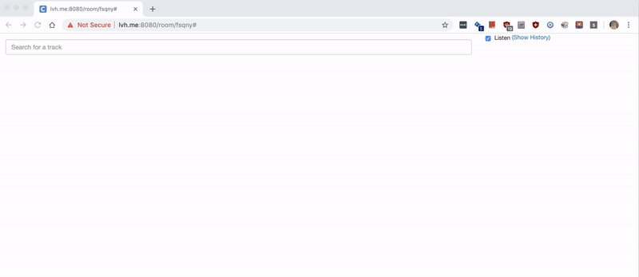

# Consensus

After 7pm in Foursquare NYC music is played throughout the office. Consensus was created to enable users to enqueue songs from SoundClould, YouTube, and Spotify. Every client connected to Consensus can optionally choose to listen to the current song being played. At the Foursquare office, we have a Mac mini permanenty connected to Consensus which plays music through a hi-fi stereo system. The ability to upvote and downvote a song was implemented to prevent song trolling. 
